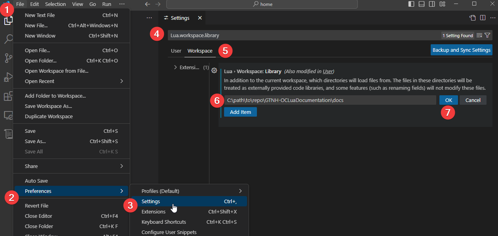

# GTNH-OCLuaDocumentation
Basic Lua documentation for Open Computer types for use with GTNH

## How to use for auto-completion in VS Code
1. Install this extension: https://marketplace.visualstudio.com/items?itemName=sumneko.lua
2. Open the VS code settings (<kbd>Ctrl</kbd>+<kbd>,</kbd>).
3. Switch to the `Workspace` tab.
4. Search for `Lua.workspace.library`.
5. Click `Add Item` and enter the path to `docs` folder in the input.
6. Click OK

